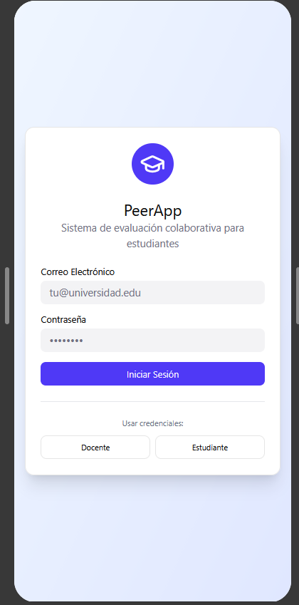
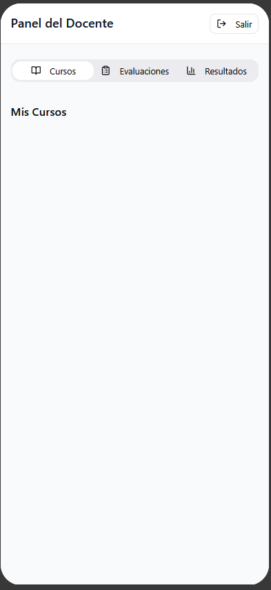
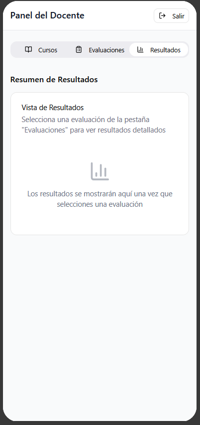
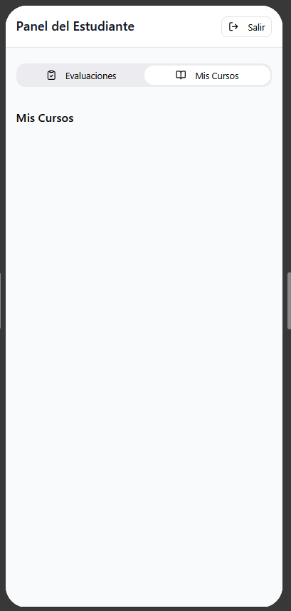

# Propuesta Individual: PeerApp

## 1. Referentes

**Brightspace**
Plataforma institucional donde ya se crean los grupos, por lo tanto la aplicación debe integrarse con esta estructura.

**Google Classroom**
Referencia en gestión de cursos y claridad en experiencia de usuario.

**Peergrade**
Permite evaluación entre pares mediante rúbricas estructuradas y reportes consolidados.

## 2. Propuesta de solución

Se propone una única aplicación móvil en Flutter con manejo de roles (docente y estudiante) dentro de la misma app. debido a que:

* Simplifica mantenimiento.
* Permite reutilización de módulos.
* Facilita escalabilidad.
* Se ajusta a Clean Architecture.

## 3. Arquitectura

**Presentation**

* Flutter + GetX (estado, navegación e inyección de dependencias).

**Domain**

* Entidades: User, Course, Group, Assessment, Evaluation.
* Casos de uso: crear evaluación, importar grupos, enviar evaluación, calcular promedios.

**Data**

* Repositorios.
* Autenticación y base de datos con Roble.
* Integración con Brightspace para importar grupos.

## 4. Flujo funcional

Prototipo en Figma:
[https://www.figma.com/make/VRuKYzpeuI5RLN6NUFUrhQ/PeerApp?t=P4uIQfmYezXaDwLt-1](https://www.figma.com/make/VRuKYzpeuI5RLN6NUFUrhQ/PeerApp?t=P4uIQfmYezXaDwLt-1)

1. El usuario inicia sesión mediante Roble.
2. El sistema identifica el rol (docente o estudiante).
3. El docente crea cursos e importa grupos desde Brightspace.
4. El docente activa una evaluación indicando:

   * Nombre
   * Ventana de tiempo
   * Tipo de visibilidad (pública o privada)
5. Cada estudiante evalúa a sus compañeros (sin autoevaluación).
6. Al cerrar la evaluación, el sistema calcula automáticamente:

   * Promedio por estudiante
   * Promedio por grupo
   * Promedio general
7. Los resultados se muestran según la configuración definida.

## 5. Capturas del prototipo

### Login

### Docente – Cursos

### Docente – Crear evaluación

### Docente – Evaluaciones

### Docente – Resultados

### Estudiante – Mis cursos

### Estudiante – Evaluaciones

## 6. Justificación académica

La propuesta responde a problemáticas identificadas en entrevistas a docentes:

* Falta de objetividad en trabajos colaborativos.
* Dificultad para consolidar resultados manualmente.
* Escasa trazabilidad del desempeño individual.

La aplicación estandariza criterios, automatiza cálculos y permite seguimiento detallado por estudiante y actividad, manteniendo coherencia con la estructura institucional.
