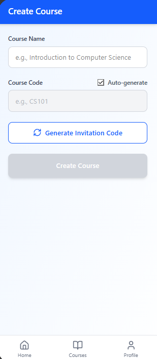
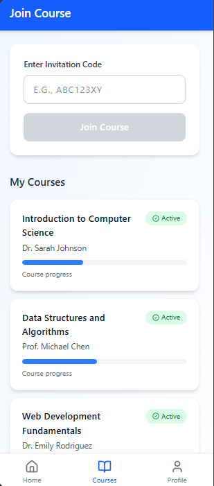
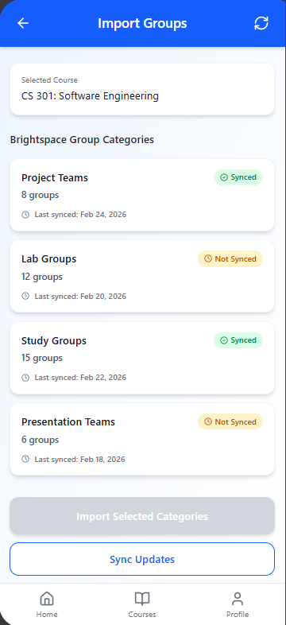
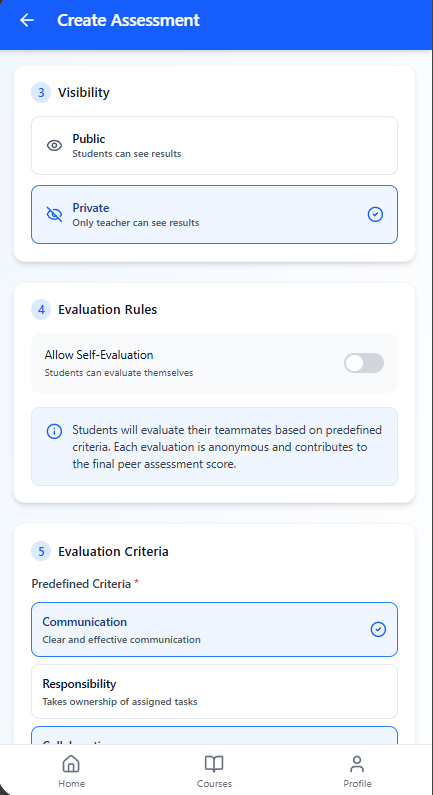
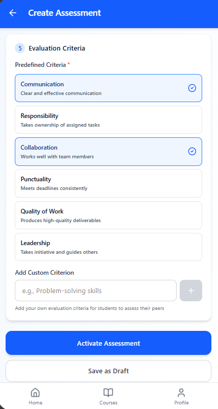
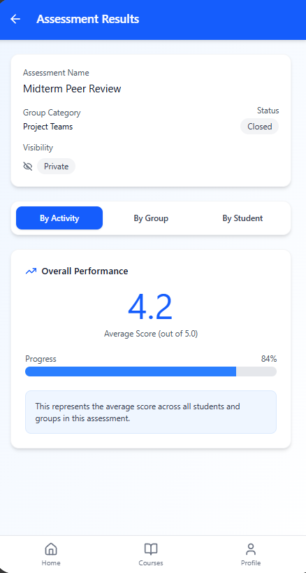
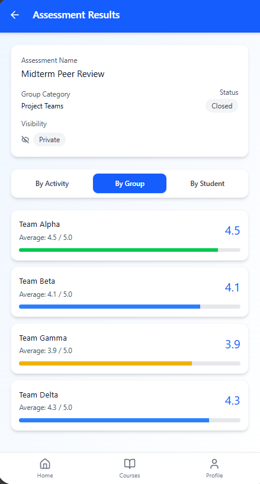
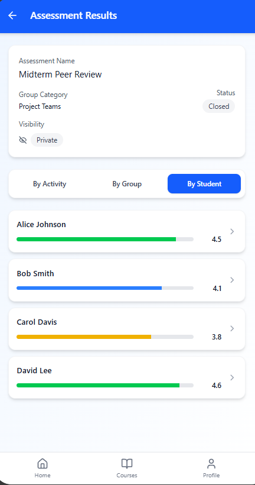
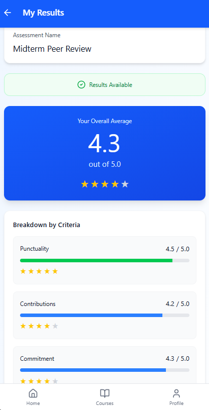

# Propuesta Individual – [Laureano Lafaurie]

## 1. Introducción
En los cursos que incorporan trabajos colaborativos, la evaluación del desempeño individual dentro de los equipos representa un desafío constante. Aunque las actividades grupales fomentan habilidades como la comunicación, la responsabilidad y el compromiso, los docentes suelen tener dificultades para medir de manera objetiva la contribución real de cada integrante, y los estudiantes no suelen tener un medio para expresar la forma en que trabajaron sus compañeros. Actualmente, los grupos se gestionan en Brightspace, pero el proceso de evaluación entre pares no siempre cuenta con una herramienta especializada, estructurada y transparente.

El presente proyecto propone el desarrollo de una aplicación móvil en Flutter, cuyo objetivo es permitir que los estudiantes evalúen el desempeño y compromiso de sus compañeros en actividades colaborativas, de manera organizada, controlada y trazable.

La aplicación busca fortalecer la equidad, transparencia y objetividad en la evaluación de trabajos colaborativos, proporcionando a los docentes herramientas analíticas claras y a los estudiantes un sistema estructurado para la retroalimentación entre pares.

## 2. Referentes
### PeerGrade
Peergrade es una plataforma especializada en evaluación entre pares que permite a los estudiantes revisar el trabajo de sus compañeros con base en rúbricas definidas por el docente.

Aportes relevantes para la propuesta:

- Uso de criterios estructurados para evaluar.

- Evaluación anónima para reducir sesgos.

- Visualización de retroalimentación organizada.

- Panel de control para docentes con métricas globales.

**Limitación identificada:**
Está más orientada a la revisión de productos académicos (ensayos, entregables), no al seguimiento del desempeño actitudinal y compromiso dentro del equipo, que es el enfoque central de nuestra app.

### CATme
CATME es una herramienta ampliamente utilizada en educación superior para la formación y evaluación de equipos de trabajo. Permite evaluar dimensiones como contribución, interacción y cumplimiento de responsabilidades.

Aportes relevantes para la propuesta:

- Evaluación basada en múltiples dimensiones del trabajo colaborativo, que pueden ser designadas por el docente.

- Reportes detallados por estudiante y por grupo.

- Análisis estadístico para el docente.

**Limitación identificada:**
Su interfaz no está pensada como aplicación móvil moderna y puede resultar compleja para uso frecuente o evaluaciones rápidas dentro de ventanas de tiempo cortas.

### Brightspace

Brightspace es el LMS institucional usado por la Uninorte donde actualmente se crean y gestionan los grupos (group categories).

Aportes relevantes para la propuesta:

- Gestión estructurada de cursos y categorías de grupo.

- Integración con listas oficiales de estudiantes.

- Organización jerárquica por cursos.

**Limitación identificada:**
No ofrece una herramienta móvil dedicada específicamente a la evaluación actitudinal y de desempeño entre pares con métricas detalladas como promedios por actividad, grupo y estudiante.

## 3. Arquitectura y diseño de la solución
La propuesta consiste en una única aplicación móvil desarrollada en Flutter, con autenticación diferenciada por rol (profesor y estudiante). Al iniciar sesión, el sistema identifica el rol del usuario y redirige automáticamente al menú correspondiente, mostrando únicamente las funcionalidades asociadas a ese perfil.

Se opta por una sola app en lugar de dos aplicaciones separadas porque permite reutilizar componentes comunes (login, cursos, grupos), simplifica el mantenimiento y mejora la coherencia en la experiencia de usuario.

### Arquitectura técnica

La aplicación seguirá los principios de Clean Architecture, organizando el proyecto en tres capas principales:

**Presentation Layer:**
Contiene las pantallas, controladores y navegación. Se utilizará GetX para la gestión de estado, inyección de dependencias y control de rutas según el rol del usuario.

**Domain Layer:**
Incluye las entidades (Usuario, Curso, Grupo, Evaluación) y la lógica de negocio, como validación de ventanas de tiempo, restricción de autoevaluación y cálculo de promedios.

**Data Layer:**
Maneja la comunicación con servicios externos, incluyendo autenticación y almacenamiento mediante Roble, así como la importación de grupos desde Brightspace.

### Diseño funcional por rol

**Profesor:**
Puede crear cursos, importar grupos, activar evaluaciones y consultar estadísticas (promedios por actividad, grupo y estudiante).

**Estudiante:**
Puede unirse a cursos, responder evaluaciones activas dentro del tiempo definido y visualizar resultados según la configuración de visibilidad.

Esta estructura garantiza una separación clara de responsabilidades, facilita el mantenimiento del proyecto y cumple con los requisitos técnicos establecidos (Clean Architecture, uso de GetX e integración con Roble).

## 4. Flujo funcional de la aplicación

### 4.1 Creación / unión a curso

**Profesor:**
El profesor crea un curso dentro de la aplicación e invita a los estudiantes mediante un código privado o mecanismo de verificación. Puede administrar múltiples cursos desde su panel principal.

**Estudiante:**
El estudiante ingresa el código de invitación o acepta la invitación recibida para unirse al curso. Una vez dentro, el curso aparece en su lista de “Mis cursos”.

### 4.2 Importación de grupos desde Brightspace

Los grupos no se crean en la app. El profesor importa las categorías de grupo previamente creadas en Brightspace, lo que garantiza que la estructura oficial del curso se mantenga sincronizada.

El sistema permite actualizar la información si hay cambios en las categorías o integrantes.

### 4.3 Activación de evaluación
El profesor selecciona una categoría de grupo y crea una evaluación definiendo:

- Nombre de la actividad

- Ventana de tiempo (duración)

- Tipo de visibilidad (pública o privada)

Durante el tiempo activo, cada estudiante evalúa a sus compañeros, y si el profesor lo permite, también a si mismos, asignando puntajes según los criterios establecidos.

### 4.4 Visualización de resultados

Una vez cerrada la evaluación:

El profesor puede consultar estadísticas detalladas:

- Promedio por actividad

- Promedio por grupo

- Promedio por estudiante

- Resultados por criterio

Los estudiantes pueden visualizar sus resultados únicamente si la evaluación fue configurada como pública.

#### Profesor

#### Estudiante

## 5. Justificación de la propuesta
La propuesta se fundamenta en el análisis de herramientas existentes de evaluación entre pares como Peergrade, CATME y el entorno institucional Brightspace. Estas plataformas demuestran que la evaluación colaborativa es una práctica consolidada en educación superior y que el uso de rúbricas estructuradas mejora la objetividad del proceso.

Sin embargo, las soluciones actuales presentan limitaciones: no están completamente optimizadas como aplicaciones móviles centradas en la experiencia ágil del estudiante, o no integran de forma clara métricas consolidadas por actividad, grupo y estudiante dentro de un mismo entorno sencillo.

La propuesta actual integra:

- Evaluación estructurada por criterios claros.

- Control de ventanas de tiempo para mayor formalidad.

- Diferenciación de visibilidad (pública o privada).

- Paneles de análisis detallado para el docente.

- Experiencia móvil moderna y simplificada.

Además, al implementar una única aplicación con autenticación por rol, se garantiza coherencia en la experiencia de usuario, menor complejidad técnica y mejor mantenibilidad del sistema.

En conjunto, la propuesta no solo replica funcionalidades existentes, sino que las adapta y optimiza para un contexto universitario específico, priorizando claridad, equidad y facilidad de uso en procesos de evaluación colaborativa.